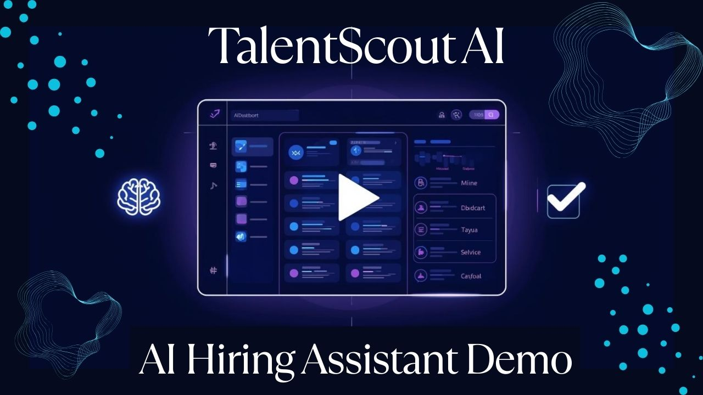
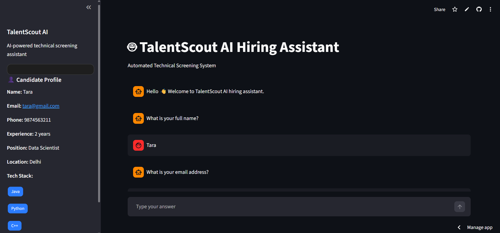
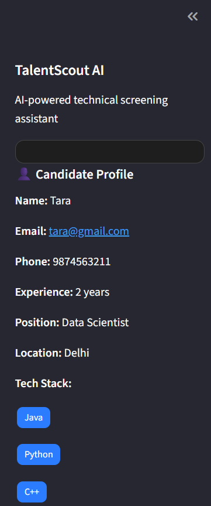
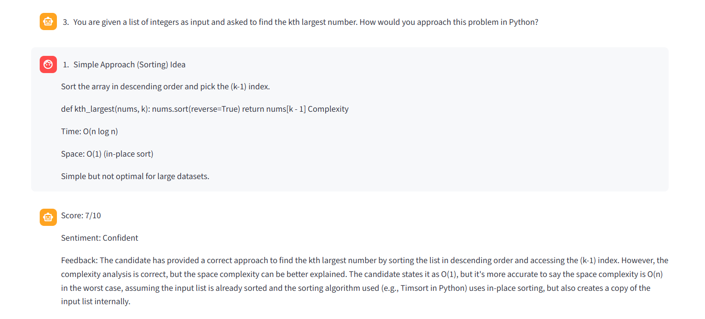
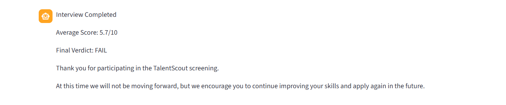

# TalentScout AI Hiring Assistant | LLM-based Chatbot for Technical Screening 🤖


An AI-powered technical hiring assistant chatbot designed to automate the initial screening process for technical candidates. The chatbot collects candidate details, generates technical interview questions based on their tech stack, evaluates responses using an LLM, and provides a final screening decision.

This project demonstrates prompt engineering, LLM integration, conversational AI, and automated candidate evaluation.

---
## 🌐 Live Demo

👉 https://talentscout-hiring-assistant-l4tgs9ecmask6gppnhadpa.streamlit.app/

## 🎥 Demo Video

Click below to watch the full demo:

<p align="center">
  <a href="https://www.loom.com/share/7677ddffec644b8fb1c145d76b042aac">
    
  </a>
</p>


---


## 🚀 Project Overview

TalentScout is a fictional recruitment agency specializing in technology placements. This AI chatbot acts as a first-stage technical screening assistant by:

- Collects candidate details  
- Generates technical questions based on tech stack  
- Evaluates answers using LLM  
- Provides score, sentiment, and feedback  
- Gives final PASS/FAIL decision  

---

## ✨ Features

### 📌 Candidate Information Collection
- Full Name
- Email Address
- Phone Number
- Years of Experience
- Desired Position
- Current Location

---

### 🧠 Technical Question Generation
Based on the technologies provided by the candidate, the chatbot generates technical interview questions dynamically. The system generates multiple interview questions for each technology.

Example tech stack:
```
Python, Java, C++
```

---

### 📊 Answer Evaluation

Each answer is evaluated on:

- Correctness  
- Clarity  
- Technical understanding  

Example output:

```
Score: 8/10  
Sentiment: Neutral  
Feedback: Good explanation but lacks depth  
Originality Score: 92.62%  
```

### 🛡️ Originality Detection

The system estimates an originality score using text similarity analysis to detect possible copied or generic responses.

Example output:
```
Score: 8/10
Sentiment: Neutral
Feedback: Good conceptual explanation but lacks implementation details
Originality Score: 92.62%

```

---

### 🎯 Automated Final Screening Decision

```
Average Score: 7.9/10  
Final Verdict: PASS
Congratulations! You are moved to the next round.
```

---

## 🏗️ Architecture

```
User Interface (Streamlit)
        │
        ▼
Conversation Manager
        │
        ▼
Prompt Engineering Layer
        │
        ▼
LLM (Groq API - Llama 3)
        │
        ▼
Evaluation Engine
        │
        ▼
Candidate Screening Decision
```

---

## 🛠️ Tech Stack

#### Programming Language

- Python

#### Framework

- Streamlit

#### LLM Integration

- Groq API (Llama 3)

#### Libraries

- streamlit

- groq

- scikit-learn

- python-dotenv

---

## 📸 Screenshots

### 🔹 Main Interface
<p align="center">
  
</p>


---

### 🔹 Candidate Profile
<p align="center">
  
</p>


---

### 🔹 Question & Evaluation
<p align="center">
  
</p>


---

### 🔹 Final Result
<p align="center">
  
</p>

---

## ⚙️ Installation

### 1. Clone Repository

```bash
git clone https://github.com/DHANASHRI1221/talentscout-hiring-assistant.git
cd talentscout-hiring-assistant
```

### 2. Install Dependencies

```bash
pip install -r requirements.txt
```

### 3. Add API Key

Create `.env` file:

```
GROQ_API_KEY=your_api_key_here
```

### 4. Run App

```bash
streamlit run app.py
```

---

## 🔐 Security

- API keys are stored securely  
- `.env` is not uploaded to GitHub  
- Uses Streamlit Secrets in deployment  

---

## 🚧 Challenges Faced

- Handling API errors and rate limits  
- Maintaining conversation state in Streamlit  
- Designing structured prompts for consistent LLM output  
- Parsing LLM responses reliably  

---

## 📚 Learnings

- Prompt engineering for structured outputs  
- Integrating LLM APIs into applications  
- Building conversational workflows  
- Deploying AI apps using Streamlit Cloud  
- Implementing NLP-based similarity detection  

---
## 🚧 Future Improvements

- Multilingual chatbot  
- Resume parsing  
- Adaptive questioning  
- Better UI/UX  

---
## 💡 Why This Project

This project demonstrates how LLMs can be used to automate real-world hiring workflows, reducing manual effort and improving candidate screening efficiency.

## 👩‍💻 Author

Dhanashri Shivdas 


